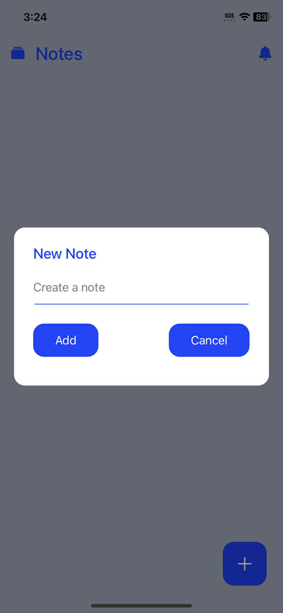
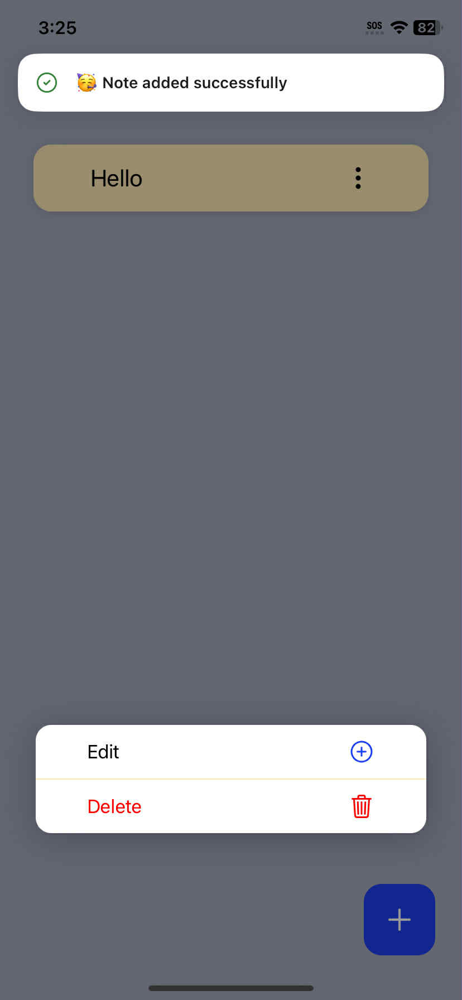
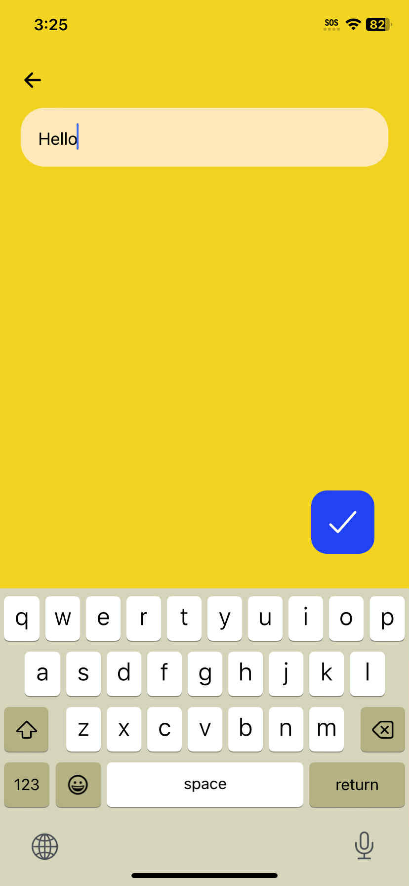

# Simple Note App

A clean and simple note-taking application built with React Native and Expo. This project demonstrates core concepts like state management, component-based structure, and local storage persistence.






## ## Tech Stack

* **React Native**
* **Expo** (Managed Workflow)
* **Zustand** (for simple state management)
* **NativeWind** (for Tailwind CSS styling)
* **Expo Router** (for file-based navigation)
* **sonner-native** (for toast notifications)

## ## Getting Started

This project is designed to run with the **Expo Go** app, so no native build is required.

### ### Prerequisites

* [Node.js](https://nodejs.org/) (LTS version) installed on your computer.
* The **Expo Go** app installed on your iOS or Android device.
    * [Download for iOS](https://apps.apple.com/us/app/expo-go/id982107779)
    * [Download for Android](https://play.google.com/store/apps/details?id=host.exp.exponent)


## ## Running the Application

1.  **Start the development server:**
    ```bash
    npx expo start
    ```
2.  **Open on your phone:**
    * A new browser tab will open showing a QR code.
    * Open the **Expo Go** app on your phone.
    * Scan the QR code with your phone's camera (iOS) or from within the Expo Go app (Android).

The application will now be running on your device!